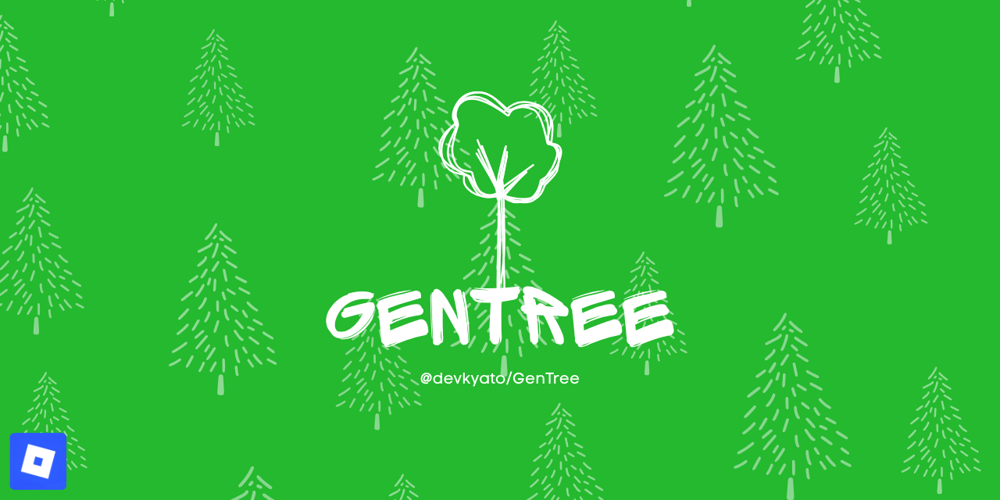
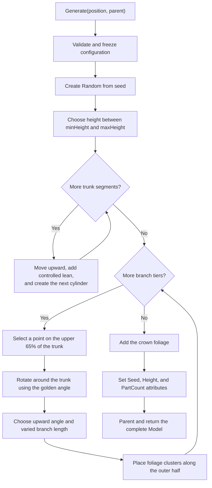
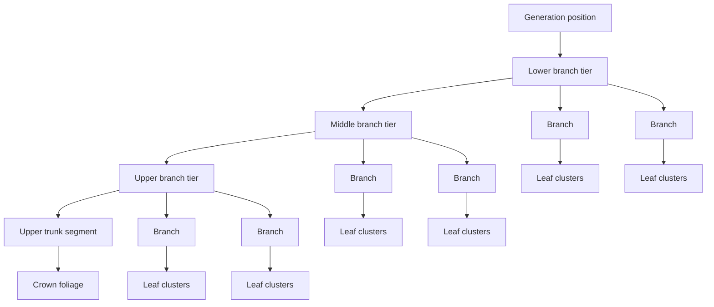
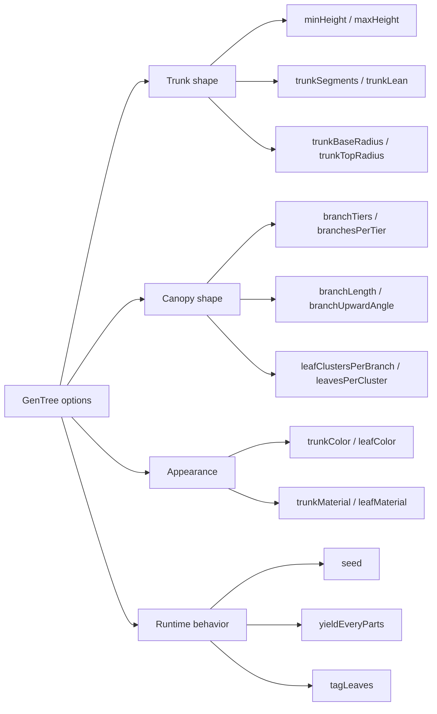
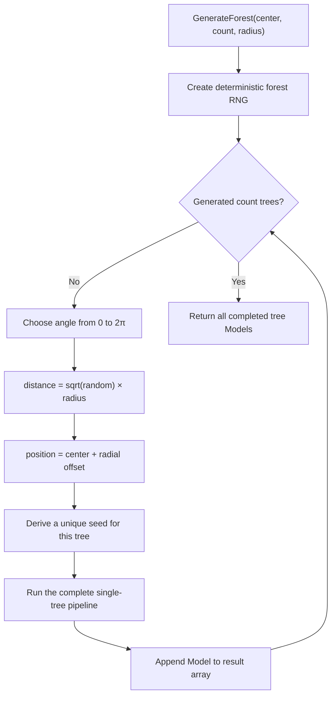

<p align="center">
  
</p>

<p align="center">
  <a href="https://github.com/devkyato/GenTree/actions/workflows/ci.yml"></a>
  <a href="https://github.com/devkyato/GenTree/releases/latest"></a>
  <a href="https://github.com/devkyato/GenTree/blob/main/LICENSE"></a>
</p>

# GenTree

GenTree is a small procedural tree generator I made for Roblox. I wanted to see how
far I could get with ordinary Parts, a seed, and a few rules instead of storing a
finished tree model. The result builds the trunk, branches, and foliage entirely from
Luau and returns one organized `Model`.

> [!NOTE]
> Oh! Just to be clear, this is a random personal project I made for experimenting and
> learning. It is not an official Roblox product or a full production forestry system.
> I still keep the package, documentation, and releases tidy so it is pleasant to try.

## Why I made this

I liked the idea of dropping one module into a project and asking it for a tree at any
position. At that point I thought, “What if the same little system could also make a
repeatable forest?” That is why GenTree has both single-tree and forest APIs, along
with an optional seed.

The design has a few simple goals:

- Generate everything from code—no hidden tree assets.
- Return a complete model, not one that is still filling in later.
- Keep every visual choice in one configuration table.
- Make seeded results repeatable enough to save and rebuild a layout.
- Stay small enough that someone can read the source and understand the whole idea.

## Get GenTree

### GitHub release

Download `GenTree-0.1.1.rbxm` from the
[latest release](https://github.com/devkyato/GenTree/releases/latest), place it under
`ServerScriptService`, and require it from a server script.

### Wally

The repository is packaged for Wally as `devkyato/gentree`. Once that version is
available in the registry, add it to your server dependencies:

```toml
[server-dependencies]
GenTree = "devkyato/gentree@0.1.1"
```

Then run:

```sh
wally install
```

Map `ServerPackages` or `Packages` into `ServerScriptService` in your Rojo project:

```lua
local ServerScriptService = game:GetService("ServerScriptService")
local GenTree = require(ServerScriptService.Packages.GenTree)
```

## Make one tree

```lua
local ServerScriptService = game:GetService("ServerScriptService")
local Workspace = game:GetService("Workspace")

local GenTree = require(ServerScriptService.Packages.GenTree)

local generator = GenTree.new({
	seed = 42,
	minHeight = 24,
	maxHeight = 32,
	branchesPerTier = 6,
})

local tree = generator:Generate(Vector3.new(0, 0, 0), Workspace)
print(tree:GetAttribute("PartCount"))
```

For a quick tree with the defaults:

```lua
local tree = GenTree.generate(Vector3.new(0, 0, 0), workspace)
```

And for a forest:

```lua
local trees = generator:GenerateForest(
	Vector3.new(0, 0, 0),
	25, -- tree count
	80, -- radius
	workspace
)
```

## How I think about generation

I think of one tree as a bottom-up pipeline. The trunk gives me a set of reliable
attachment points, the branch tiers turn those points into a canopy, and the leaves
fill the outside of that canopy. Here is the full trip through
[`Generator.lua`](src/Generator.lua):



One detail I cared about here: I build every descendant before I parent the model.
That means `Generate` returns a finished tree. `yieldEveryParts` can still pause a
large build occasionally, but callers never receive a half-populated model.

### Oh! On the trunk part

The trunk is a chain of cylinders. Each new point moves upward by one segment and
takes a small seeded step sideways. I interpolate from `trunkBaseRadius` to
`trunkTopRadius`, so the separate cylinders read as one leaning, tapered trunk.

[`Geometry.partBetween`](src/Geometry.lua) does the reusable part: it finds the
midpoint between two positions, sizes a cylinder to that distance, and rotates its
long axis toward the next point.

### How the branches become a canopy

At this point, I thought too about how evenly spaced branches can look strangely
artificial. I use the golden angle to keep rotating around the trunk without stacking
every tier into the same few directions. Then I add a small seeded variation to the
angle, lift, and length.



The leaves are simple Ball Parts. I vary their size, color, rotation, and position
inside each cluster. They stay anchored and non-collidable, and I tag them
`GenTreeLeaf` by default so a separate wind or effects system can find them.

### How the options change the result

I kept the controls grouped by what they affect. If I want a taller silhouette, I can
stay in the trunk settings. If I want a denser tree, I can work only on canopy values.
[`Config.lua`](src/Config.lua) owns the defaults and rejects unknown or invalid options
before generation begins.



### How I spread a forest

For forests, I sample a disk instead of a square. The angle chooses a direction around
the center, while `sqrt(random) * radius` chooses the distance. The square root matters:
without it, too many trees would crowd the middle.



```text
                  tree
            tree        tree
       tree       center       tree
            tree        tree
       tree                    tree
             circular radius
```

The forest RNG derives a different seed for every tree. With the same original seed
and configuration, I get the same positions and shapes again. Without a seed, GenTree
starts with fresh randomness.

## What comes back

Every generated tree stays easy to inspect in Explorer:

```text
GenTree (Model)
├── Trunk (Folder)
├── Branches (Folder)
└── Foliage (Folder)
```

The model includes `GenTree`, `Seed`, `Height`, and `PartCount` attributes. I use those
as a small receipt of what the generator produced.

## Configuration reference

Pass any subset of these options to `GenTree.new`. The full read-only defaults are also
available as `GenTree.DefaultConfig`.

| Option | Default | What I use it for |
| --- | ---: | --- |
| `seed` | random | Rebuild the same result when set |
| `minHeight` / `maxHeight` | `22` / `30` | Trunk height range |
| `trunkSegments` | `9` | Number of trunk cylinders |
| `trunkBaseRadius` / `trunkTopRadius` | `2.2` / `0.65` | Trunk taper |
| `trunkLean` | `1.4` | Horizontal trunk wandering |
| `branchTiers` | `4` | Vertical canopy layers |
| `branchesPerTier` | `5` | Branches in each layer |
| `branchLength` | `11` | Average branch length |
| `branchLengthVariation` | `3` | Seeded length variation |
| `branchUpwardAngle` | `24` | Average branch lift in degrees |
| `leafClustersPerBranch` | `3` | Foliage groups on each branch |
| `leavesPerCluster` | `4` | Leaf Parts in each group |
| `leafSize` | `Vector3.new(3.6, 3.2, 3.6)` | Base leaf size |
| `leafSpread` | `3.2` | Cluster radius |
| `yieldEveryParts` | `80` | Yield interval; `0` disables yielding |

Colors, materials, collision, and leaf tagging are configurable too. Set
`tagLeaves = false` if you do not want CollectionService tags.

## Where each idea lives

| File | What I put there |
| --- | --- |
| [`src/init.lua`](src/init.lua) | The small public API and current version |
| [`src/Generator.lua`](src/Generator.lua) | Single-tree and forest generation |
| [`src/Geometry.lua`](src/Geometry.lua) | Cylinder alignment and random unit vectors |
| [`src/Config.lua`](src/Config.lua) | Defaults, override checks, and validation |
| [`src/Types.lua`](src/Types.lua) | Public Luau types |
| [`examples/GenerateTree.server.lua`](examples/GenerateTree.server.lua) | A tiny tree-and-forest example |

## Working on it locally

```sh
aftman install
wally install
stylua --check src examples
selene src examples
rojo build package.project.json --output GenTree.rbxm
```

Serve `demo.project.json` with Rojo if you want to open the example place. I keep
versions in `wally.toml` and `src/init.lua` together; a matching `vX.Y.Z` tag builds
the `.rbxm`, creates a GitHub release, and publishes to Wally when
`WALLY_AUTH_TOKEN` is configured.

If you want to change something, [CONTRIBUTING.md](CONTRIBUTING.md) has the short
workflow. [CHANGELOG.md](CHANGELOG.md) keeps the release story.
