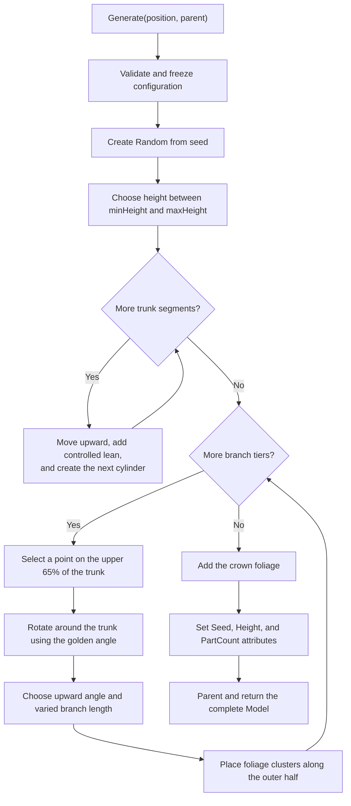
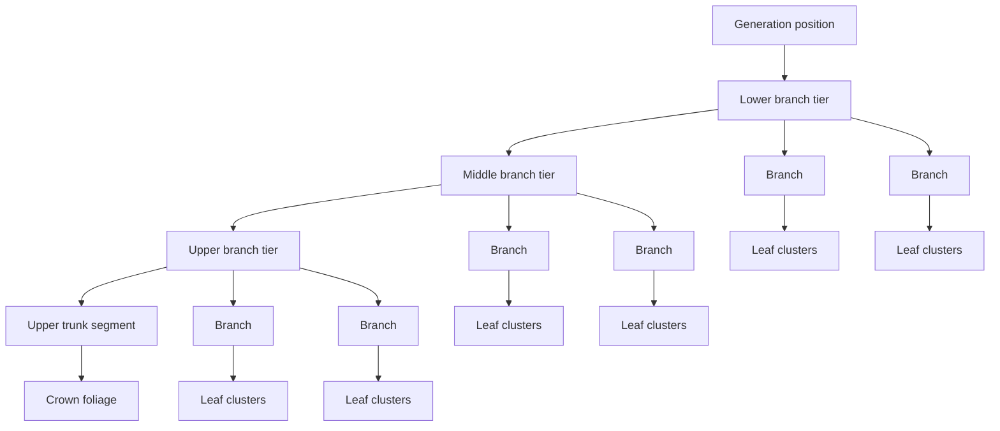
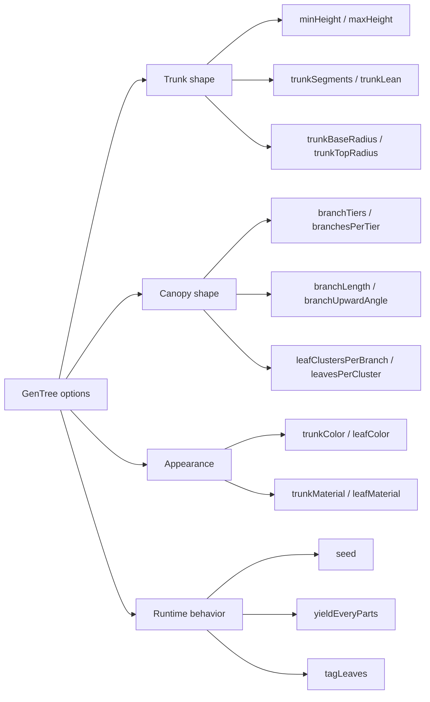
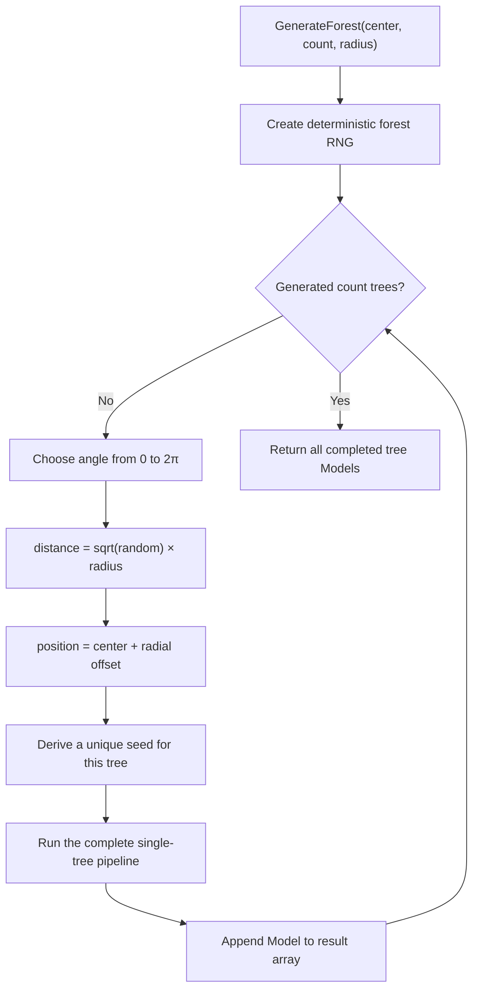

<p align="center">
  
</p>

<p align="center">
  <a href="https://github.com/devkyato/GenTree/actions/workflows/ci.yml"></a>
  <a href="https://github.com/devkyato/GenTree/releases/latest"></a>
  <a href="https://github.com/devkyato/GenTree/blob/main/LICENSE"></a>
</p>

# GenTree

GenTree is a small, server-side procedural tree generator for Roblox. It builds a
complete `Model` from code—trunk, branches, and foliage—with no prebuilt tree assets.
Generation can be deterministic, configuration is validated up front, and the returned
model is complete when `Generate` returns.

> [!NOTE]
> **Disclaimer:** this is just a random personal project made for experimentation and
> learning. It is provided as-is and is not an official Roblox product or a production
> forestry system.

## Install

### Wally

Add GenTree to the server dependencies in your `wally.toml`:

```toml
[server-dependencies]
GenTree = "devkyato/gentree@0.1.0"
```

Then install:

```sh
wally install
```

Map `ServerPackages` or `Packages` into `ServerScriptService` in your Rojo project,
then require the package:

```lua
local ServerScriptService = game:GetService("ServerScriptService")
local GenTree = require(ServerScriptService.Packages.GenTree)
```

You can also download `GenTree.rbxm` from the
[latest GitHub release](https://github.com/devkyato/GenTree/releases/latest).

## Generate a tree

```lua
local ServerScriptService = game:GetService("ServerScriptService")
local Workspace = game:GetService("Workspace")

local GenTree = require(ServerScriptService.Packages.GenTree)

local generator = GenTree.new({
	seed = 42,
	minHeight = 24,
	maxHeight = 32,
	branchesPerTier = 6,
})

local tree = generator:Generate(Vector3.new(0, 0, 0), Workspace)
print(tree:GetAttribute("PartCount"))
```

For a quick one-off tree:

```lua
local tree = GenTree.generate(Vector3.new(0, 0, 0), workspace)
```

For a forest:

```lua
local trees = generator:GenerateForest(
	Vector3.new(0, 0, 0),
	25, -- tree count
	80, -- radius
	workspace
)
```

## How generation works



The package deliberately generates all descendants before parenting the final model.
Callers never receive a half-built tree, while `yieldEveryParts` can still yield during
large builds to reduce long frame stalls.

### Tree anatomy

The result is a bottom-up trunk with branch tiers distributed around it. Each branch
receives several foliage clusters, and a final cluster closes the canopy at the top.



Every generated tree has this Explorer structure:

```text
GenTree (Model)
├── Trunk (Folder)
├── Branches (Folder)
└── Foliage (Folder)
```

Useful model attributes include `GenTree`, `Seed`, `Height`, and `PartCount`. Leaves
are tagged `GenTreeLeaf` by default for wind or effects systems.

### What the settings control



### How forests are distributed

`GenerateForest` samples a disk rather than a square. Taking the square root of the
random distance prevents trees from bunching up near the center.



```text
                  tree
            tree        tree
       tree       center       tree
            tree        tree
       tree                    tree
             circular radius
```

With the same configuration and seed, the same forest layout and individual tree
shapes are produced again. Without a seed, each call receives fresh randomness.

## Configuration

Pass any subset of these options to `GenTree.new`. Unknown options and invalid values
fail immediately with a clear error.

| Option | Default | Purpose |
| --- | ---: | --- |
| `seed` | random | Reproduce the same tree when set |
| `minHeight` / `maxHeight` | `22` / `30` | Trunk height range |
| `trunkSegments` | `9` | Number of tapered trunk pieces |
| `trunkBaseRadius` / `trunkTopRadius` | `2.2` / `0.65` | Trunk taper |
| `trunkLean` | `1.4` | Maximum horizontal wandering |
| `branchTiers` | `4` | Vertical branch layers |
| `branchesPerTier` | `5` | Branches in each layer |
| `branchLength` | `11` | Average branch length |
| `branchLengthVariation` | `3` | Random length variation |
| `branchUpwardAngle` | `24` | Average upward angle in degrees |
| `leafClustersPerBranch` | `3` | Foliage groups on each branch |
| `leavesPerCluster` | `4` | Leaf parts in each group |
| `leafSize` | `Vector3.new(3.6, 3.2, 3.6)` | Base leaf size |
| `leafSpread` | `3.2` | Cluster radius |
| `yieldEveryParts` | `80` | Yield interval; `0` disables yielding |

The full defaults, including colors, materials, collision, and leaf tags, are exposed
as the read-only `GenTree.DefaultConfig` table. Set `tagLeaves = false` to disable
CollectionService tagging.

## Development

```sh
aftman install
wally install
stylua --check src examples
selene src examples
rojo build package.project.json --output GenTree.rbxm
```

To open the included example place with Rojo, serve `demo.project.json`.

Releases follow semantic versioning. A `vX.Y.Z` tag must match both `wally.toml` and
`GenTree.Version`; CI then builds an `.rbxm`, creates a GitHub release, and publishes
to Wally when the repository has a `WALLY_AUTH_TOKEN` secret.

See [CONTRIBUTING.md](CONTRIBUTING.md) and [CHANGELOG.md](CHANGELOG.md) for the
maintenance workflow.
